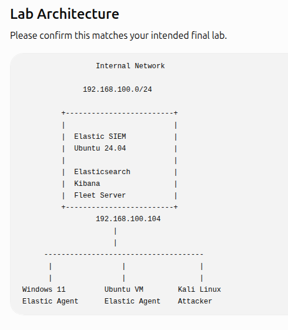

# Lab Architecture

## Purpose

The lab models a small SOC pipeline: endpoints and servers generate telemetry, Elastic Agent or native integrations transport events, Elasticsearch stores and indexes them, and Kibana/Elastic Security supports detection and investigation.

## Components

| System | Role | Telemetry |
|---|---|---|
| `elastic-siem` | Elasticsearch, Kibana, and planned Fleet Server | Platform and audit logs |
| Windows endpoint | Monitored endpoint | Security, Sysmon, and PowerShell logs |
| Linux endpoint/server | Monitored endpoint | Authentication, sudo, process, and service logs |
| Web server | Monitored workload | Access and error logs |
| Kali/Parrot test host | Authorized attack simulation | Generates controlled test activity |

## Trust boundaries

- The management path is separate from monitored workload traffic where practical.
- Internet access is enabled only when required for package installation, integration downloads, or repository synchronization.
- Elastic services use TLS.
- Private keys and credentials remain on the lab systems and never enter Git.
- Screenshots must be sanitized before publication.

## Network decision

A second adapter does not automatically make the lab “enterprise.” Segmentation, least privilege, controlled egress, and documented trust boundaries do. Use one internal lab network for telemetry and management, and enable a NAT/egress adapter only when needed. Do not bridge the SIEM directly to an untrusted network merely to make Git pushes easier.
