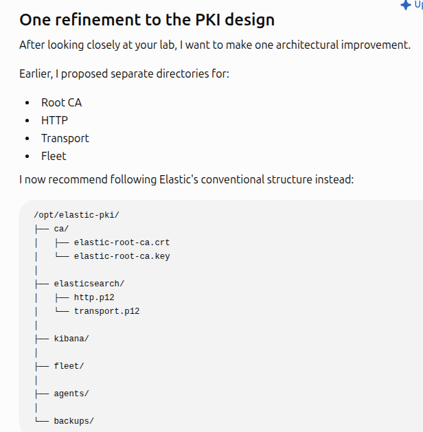
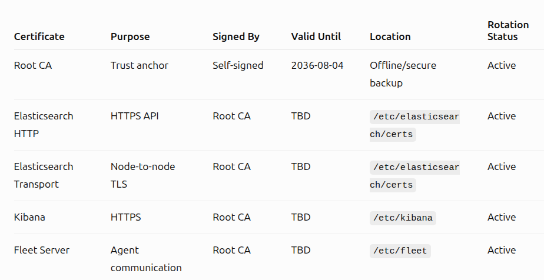

# PKI Design and Implementation

## Scope

This document records the lab's custom HTTP TLS work for Elasticsearch. It is documentation—not a source of private keys or certificate bundles.



## Established design

| Item | Value |
|---|---|
| PKI workspace | `/opt/elastic-pki` |
| Root CA distinguished name | `Cybersafe SOC Lab Root CA` |
| Root CA lifetime | 3650 days |
| Root key size | 4096 bits |
| Root key protection | Password-encrypted |
| Elasticsearch version | 9.3.3 |
| Elasticsearch node | `elastic-siem` |
| HTTP protocol | HTTPS |

Workspace layout:

```text
/opt/elastic-pki/
├── backups/
├── ca/
├── documentation/
├── generated/
└── instances/
```

## Security model

- The CA private key is encrypted and remains outside Git.
- Generated archives, private keys, PKCS#12 files, keystores, passwords, and enrollment tokens are excluded by `.gitignore`.
- Certificates must contain only the SANs actually used by clients.
- File ownership and permissions must be verified before service restart.
- Backups are stored under controlled local paths, not in this repository.

## Implemented evidence

The [PKI screenshot set](../screenshots/01-pki/) records:

1. workspace creation;
2. root CA creation;
3. encrypted-key verification;
4. instance definition;
5. HTTP certificate request and generation;
6. archive inspection and staging permissions;
7. SAN and key-match validation;
8. TLS validation through localhost, IP, and hostname;
9. managed Elasticsearch HTTP TLS configuration.

## Validation controls

A successful TLS deployment requires all of the following:

- certificate chain validates against the intended CA;
- certificate and private key match;
- hostname/IP used by the client appears in the SAN extension;
- Elasticsearch starts without TLS errors;
- authenticated HTTPS requests succeed;
- no `-k`/insecure bypass is used for final validation.

## Certificate lifecycle

Maintain an inventory containing certificate purpose, subject, SANs, issuer, serial number, validity dates, storage path, owner, and renewal date. Rotate before expiry, revoke compromised certificates, and retest every dependent service after rotation.



## Limitation

This is currently a direct root-CA signing design suitable for a controlled homelab. A future intermediate CA improves key isolation; see [the migration plan](12-pki-migration-to-intermediate-ca.md).
